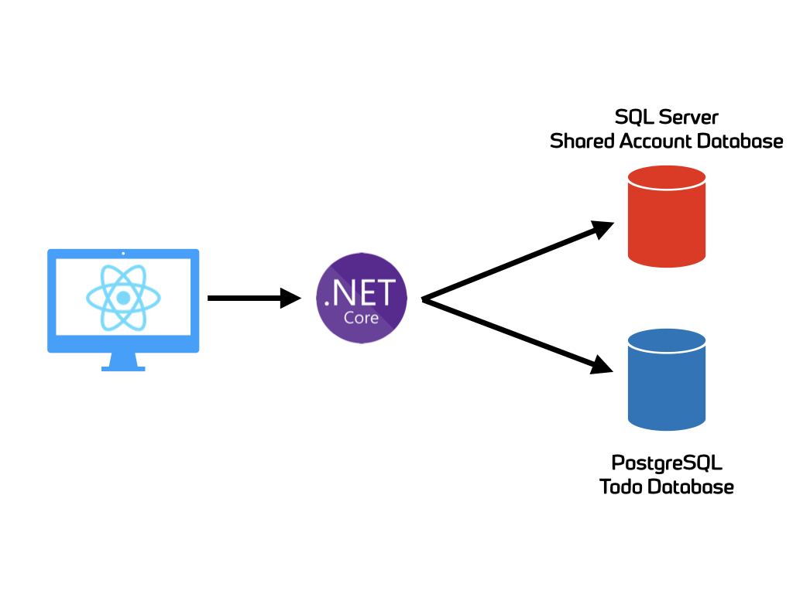

# Spawn demo app - frontend

This is the frontend portion of the Spawn demo app. The app showcases a semi complex application that takes advantage of [Spawn](https://spawn.cc/) to simplify development.

## Architecture

The application is a simple "Todo" application. It's architecture is as follows:

* C# ASP.NET Core WebAPI
* ReactJS Frontend
* Microsoft SQL Server database (for "account" information)
* PostgreSQL database (for "todo" item information)



## Building

```
cd client
docker build -t spawn-demo-frontend .
```

## Running

```
docker run --rm -d -p 3000:80 spawn-demo-frontend
```
